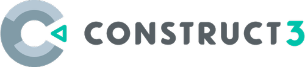

<p align="center">
  
</p>

<h1 align="center">Valet</h1>
<p align="center">Lightweight local web server and browser launcher — serve HTML5 apps with zero configuration</p>

<p align="center">
 <a href="https://ryanbram.itch.io/valet-lightweight-local-web-server-and-browser-launcher">Download</a>
</p>

---

## Features

- 🚀 **Auto Port Detection** - Automatically finds available ports, no conflicts
- 🪶 **Tiny Size** - ~1 MB executable vs 200 MB for Electron/NW.js
- ⚡ **Fast Startup** - Launch in 1-2 seconds with built-in HTTP server
- 🌐 **Browser Integration** - Uses Edge/Chrome in app mode for native feel
- 🔧 **NW.js Compatible** - Drop-in replacement using `package.json` configuration
- 📊 **Console Output** - Always-visible debugging and server logs

## Quick Start

### Minimal Setup

1. Create a `package.json` in your project directory:

```json
{
  "name": "my-app",
  "main": "index.html",
  "window": {
    "title": "My App",
    "width": 960,
    "height": 720
  }
}
```

2. Place `valet.exe` in the same directory

3. Run the application:

```powershell
.\valet.exe
```

That's it! Valet will:

1. Auto-detect an available port
2. Start an HTTP server
3. Launch Edge/Chrome in app mode
4. Display console output for debugging

## Configuration

Valet supports both NW.js-compatible fields and Valet-specific options:

### Basic Configuration

| Field           | Type   | Default        | Description            |
| --------------- | ------ | -------------- | ---------------------- |
| `name`          | string | `"valet-app"`  | Application name       |
| `main`          | string | `"index.html"` | Entry HTML file        |
| `window.title`  | string | `"Valet App"`  | Window title           |
| `window.width`  | int    | `960`          | Window width (pixels)  |
| `window.height` | int    | `720`          | Window height (pixels) |

### Advanced Configuration

```json
{
  "name": "valet-app",
  "main": "index.html",
  "window": {
    "title": "Valet App",
    "width": 960,
    "height": 720
  },
  "valet": {
    "server": {
      "port": 0
    },
    "browser": {
      "executable": "msedge",
      "userDataDir": ".valet_data",
      "privateMode": true,
      "showToolbar": true
    }
  }
}
```

### Valet-Specific Options

| Field                         | Type   | Default         | Description                |
| ----------------------------- | ------ | --------------- | -------------------------- |
| `valet.server.port`           | int    | `0`             | Port (0 = auto-detect)     |
| `valet.browser.executable`    | string | `"msedge"`      | Browser to use             |
| `valet.browser.userDataDir`   | string | `".valet_data"` | User data directory        |
| `valet.browser.incognitoMode` | bool   | `true`          | Use incognito/private mode |

### Default Chromium Flags

Valet automatically applies these flags for a clean environment:

- `--disable-extensions` - Disables browser extensions
- `--disable-translate` - Disables Google Translate popup
- `--incognito` - Private browsing mode (when `incognitoMode: true`)

## Build from Source

### Prerequisites

- **Nim >= 2.0.0** - Install from [nim-lang.org](https://nim-lang.org/)
- **Git** - For cloning the repository

Verify Nim installation:

```powershell
nim --version
```

### Compilation

**Using build script:**

```powershell
.\build.bat
```

**Manual compilation:**

```powershell
nim c -d:release --opt:size -o:valet.exe src/valet.nim
```

**Output:** `valet.exe` (~1 MB)

### Build Options

For maximum size optimization:

```powershell
nim c -d:release --opt:size --passL:-s src/valet.nim
```

Flags explained:

- `-d:release` - Enable release mode optimizations
- `--opt:size` - Optimize for smaller binary size
- `--passL:-s` - Strip debug symbols

## Supported Engines

Valet works seamlessly with popular HTML5 game engines and web frameworks:

<p align="center">
  
  <br>
  
  <br>
  
</p>

<p align="center"><sub>...and many more HTML5 frameworks!</sub></p>

## Use Cases

- 🎮 **RPG Maker MV/MZ Games** - Test games locally before web deployment
- 📦 **HTML5 Game Distribution** - Package Construct 3 or GDevelop games
- 🌐 **Standalone Web Apps** - Convert web apps to desktop applications
- 🔧 **Local Development** - Quick HTTP server with automatic browser launch
- 🎨 **Interactive Presentations** - Serve HTML-based presentations locally

## Comparison with Alternatives

| Feature        | Valet          | Rover          | Electron/NW.js   |
| -------------- | -------------- | -------------- | ---------------- |
| Size           | ~1 MB          | ~200 KB        | ~200 MB          |
| Startup Time   | 1-2 seconds    | Instant        | 3-5 seconds      |
| Memory Usage   | ~50 MB         | ~30 MB         | ~150 MB          |
| Server         | HTTP server    | No server      | No server        |
| Node.js APIs   | ❌ No          | ❌ No          | ✅ Yes           |
| Console Output | Always visible | Hidden         | Hidden           |
| Rendering      | OS Browser     | Native WebView | Bundled Chromium |

### When to Use Valet

✅ Your app needs HTTP server functionality  
✅ You want visible console output for debugging  
✅ You prefer using the OS's browser engine  
✅ You need to test web apps before deployment

### When to Use Rover

✅ You want the absolute smallest package size  
✅ You need instant startup (no server overhead)  
✅ Your app doesn't require HTTP server features

### When to Use Electron/NW.js

✅ You need Node.js APIs (fs, child_process, etc.)  
✅ You require consistent rendering across platforms  
✅ You need advanced desktop integration features

## Console Mode

Valet always runs in console mode, displaying:

- Server startup information
- Auto-detected port number
- Browser launch details
- HTTP request logs (optional)
- Error messages and debugging info

**Server Behavior:**

- **Browser closes** → Server continues running (you can refresh or reopen)
- **Console closes** → Server shuts down immediately

**To exit:** Press `Ctrl+C` or close the console window

This ensures:

- ✅ Clean start every time you run `valet.exe`
- ✅ Page refreshing without server restart
- ✅ Opening multiple browser windows
- ✅ Server only runs when you want it

## Migration from NW.js

Valet is designed as a drop-in replacement for NW.js:

1. **Backup your NW.js executable:**

```powershell
copy nw.exe nw.exe.bak
```

2. **Replace with Valet:**

```powershell
copy valet.exe nw.exe
```

3. **Run your existing application:**

```powershell
.\nw.exe
```

Your existing `package.json` will work as-is! Optionally add Valet-specific configuration under the `"valet"` section.

## Troubleshooting

### Browser Not Found

**Error:** `Failed to launch msedge`

**Solution:**

- Valet searches default installation paths for Edge/Chrome
- Manually specify browser in `package.json`:

```json
{
  "valet": {
    "browser": { "executable": "chrome" }
  }
}
```

### Port Already in Use

**Error:** `Failed to bind port 8080`

**Solution:**

- Set `"port": 0` for auto-detection (default behavior):

```json
{
  "valet": {
    "server": { "port": 0 }
  }
}
```

- Or manually specify a different port:

```json
{
  "valet": {
    "server": { "port": 9000 }
  }
}
```

### WebAssembly Not Loading

**Error:** `Failed to execute 'compile' on 'WebAssembly'`

**Solution:**

- Valet automatically serves `.wasm` files with correct MIME type (`application/wasm`)
- Ensure `.wasm` files are in the served directory
- Check browser console for detailed error messages
- Verify your WebAssembly module is valid

### CORS Errors

**Error:** `Access to fetch blocked by CORS policy`

**Solution:**

- Valet's HTTP server handles CORS automatically for local files
- If loading external resources, ensure they have proper CORS headers
- For development, use relative paths for all local resources

## Project Structure

```
my-app/
├── valet.exe           # Valet executable
├── package.json        # Configuration file
├── index.html          # Entry point
├── js/                 # JavaScript files
├── css/                # Stylesheets
├── assets/             # Images, fonts, audio
│   ├── images/
│   ├── fonts/
│   └── audio/
└── libs/               # Third-party libraries
```

## License

MIT License - Feel free to use in your projects!

---

<p align="center">
  <sub>Built with </sub>
</p>
